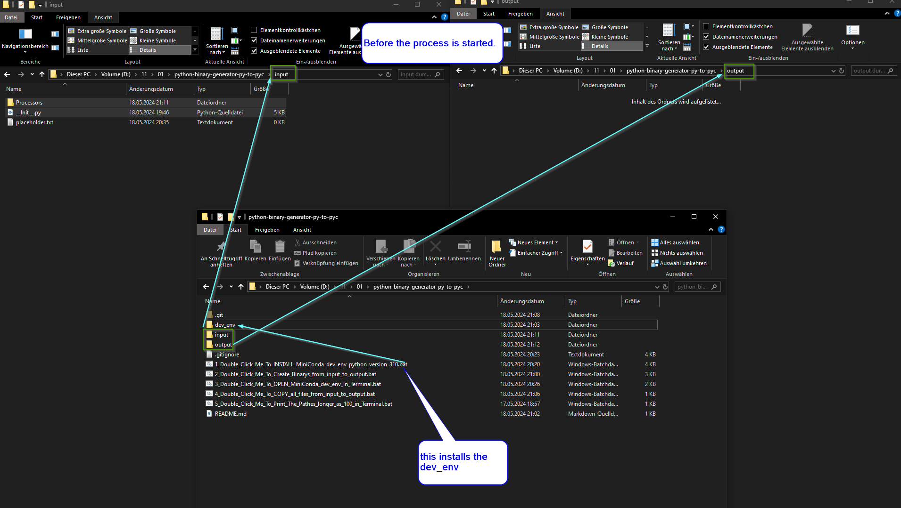
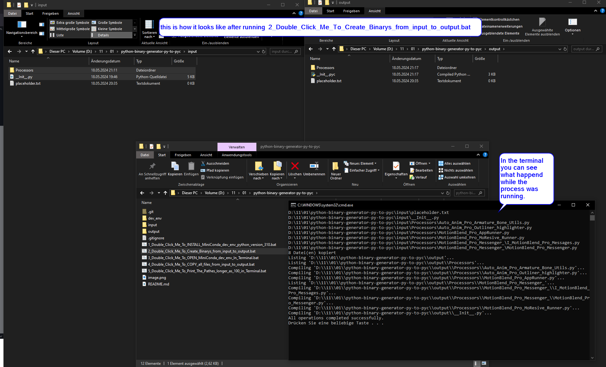
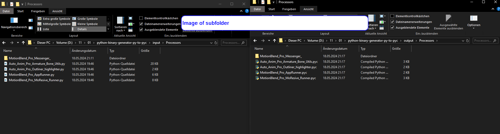

# python-binary-generator-py-to-pyc
this is a tool that generates binary files from .py files to .pyc on windows with the help of .bat files for convinience.

how to use this tool.

(Windows only)
double click on 
1_Double_Click_Me_To_INSTALL_MiniConda_dev_env_python_version_310.bat
this installs a virtual environment (miniconda) local isolated to the system.

then put your python .py files into the input folder and doubleclick 
on 
2_Double_Click_Me_To_Create_Binarys_from_input_to_output.bat

this bat file will check the input folder and copy all files inside this folder
into the output folder
then it goes through that files and generates the .pyc for all existing .py files

when its done it deletes all .py files inside the output folder.

here you can see how its meant to be used

Image before process is started

Image after the process.

It does it recursive so all files in the subfolder will also be converted.

